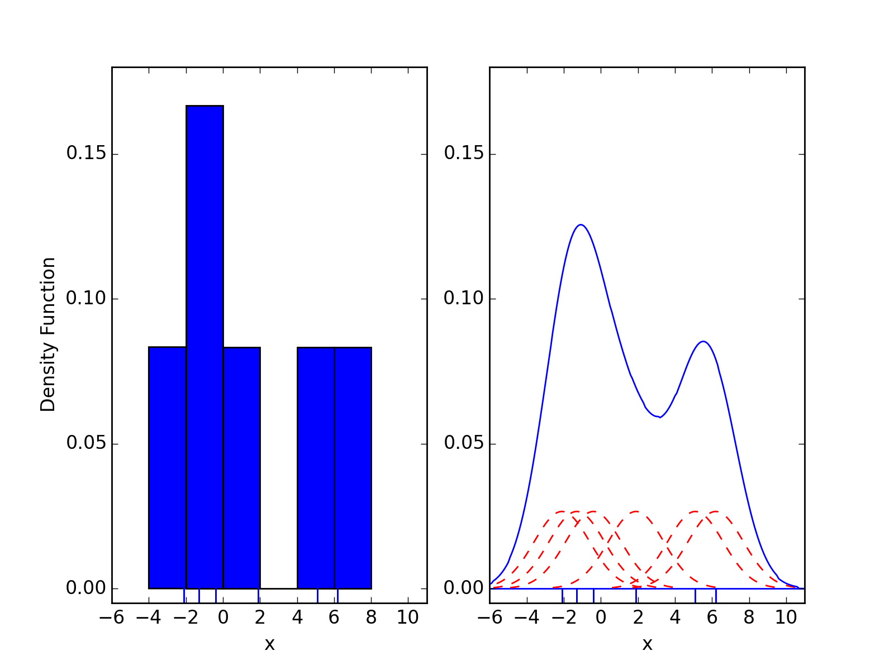
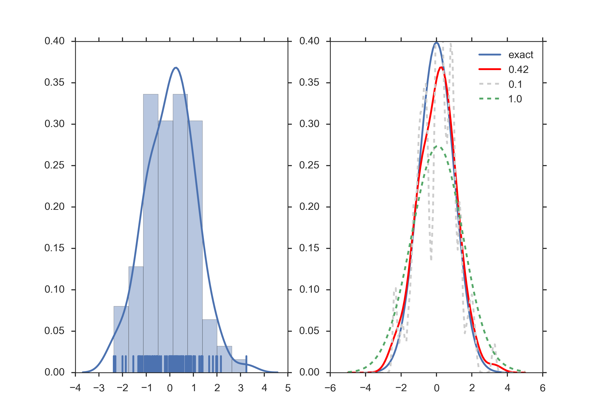
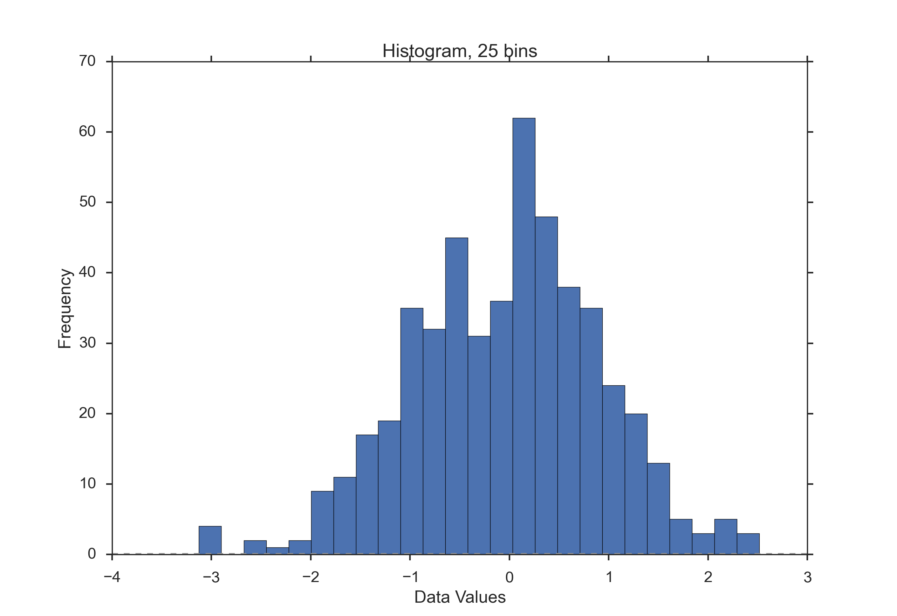
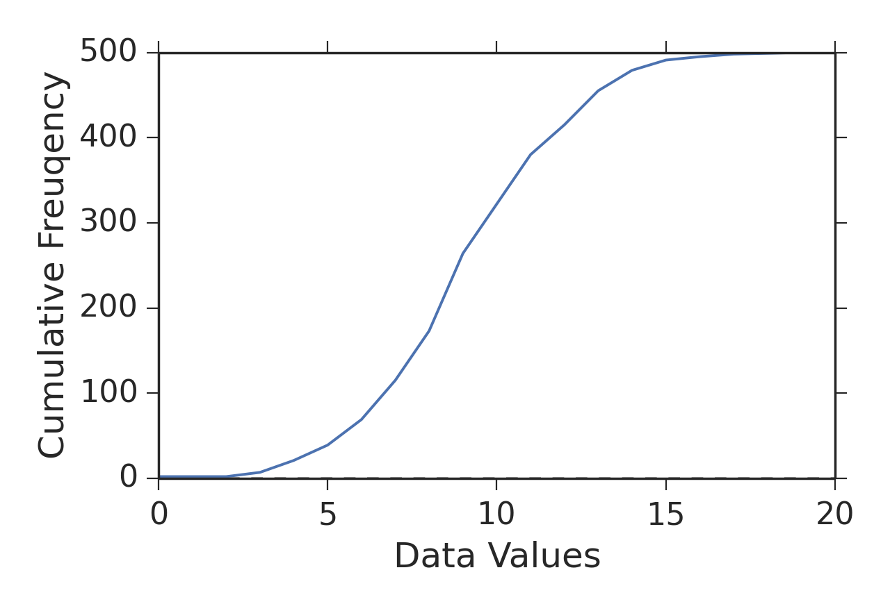
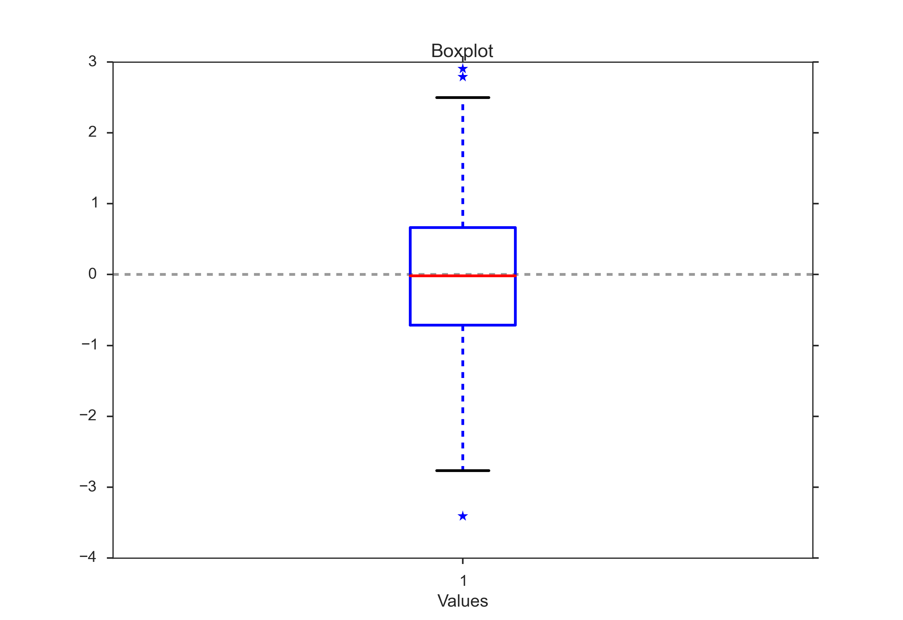

.. image:: ..\Images\title_basics.png
    :height: 100 px

.. Basic Principles
.. ================

Datatypes
---------

We begin with something that is seemingly trivial, somewhat boring - but
absolutely essential for your statistical analysis: Datatypes. Because
the type of your data directly determines the tests that are available
for the data analysis. Your data can have one of the following
datatypes:

Categorical 
~~~~~~~~~~~

.. index:: datatypes-categorical

boolean 
^^^^^^^

.. index:: datatypes-boolean

Some data can only have two values. For example,

#. male/female

#. smoker/non-smoker

nominal 
^^^^^^^

.. index:: datatypes-nominal

Many classifications require more than two categories, e.g. *married /
single / divorced*

ordinal 
^^^^^^^

.. index:: datatypes-ordinal

These are ordered categorical data, e.g. *very few / few / some / many
/ very many*

Numerical 
~~~~~~~~~

.. index:: datatypes - numerical

Numerical discrete 
^^^^^^^^^^^^^^^^^^^^

For example *Number of children: 0 1 2 3 4 5*

Numerical continuous 
^^^^^^^^^^^^^^^^^^^^^

Whenever possible, it is best to record the data in their original
continuous format, and only with a sensible number of decimal places.
For example, it does not make sense to record the body size with more
than 1 mm accuracy, as there are larger changes in body height between
the size in the morning and the size in the evening, due to compression
of the intervertebral disks.

Data Display
------------

When working with a statistical data set, you should *always* first look
at the raw-data. Our visual system is incredibly good at recognizing
patterns in visually represented data.

Scatter Plots 
~~~~~~~~~~~~~

.. index:: plots-scatterplot

This is the simplest way of representing your data: just plot each
individual data point. (In cases where many data points are superposed,
you may want to add a little bit of jitter to show each data point.)

| |image3|

Histograms 
~~~~~~~~~~~~

.. index:: plots-histogram

*Histograms* provide a first good overview of the distribution of your
data. If you divide by the overall number of data points, you get a
*relative frequency histogram*; and if you just connect the top center
points of each bin, you obtain a *relative frequency polygon*.

You can also smooth histograms with *kernel-density-estimations
(kde-plots)*. Those are nicely implemented and described in *seaborn*.

| |image4|

KDE Plots
~~~~~~~~~

.. index:: plots-KDE-plot

Kernel density estimates are closely related to histograms, but
can be endowed with properties such as smoothness or continuity by using
a suitable kernel. To see this, we compare the construction of histogram
and kernel density estimators, using these 6 data points: x = [2.1,
1.3, 0.4, 1.9, 5.1, 6.2]. For the histogram, first the horizontal axis
is divided into sub-intervals or bins which cover the range of the data.
In this case, we have 6 bins each of width 2. Whenever a data point
falls inside this interval, we place a box of height 1/12. If more than
one data point falls inside the same bin, we stack the boxes on top of
each other.

For the kernel density estimate, we place a normal kernel with variance 2.25 (indicated by the red dashed lines) on each of the data points xi. The kernels are summed to make the kernel density estimate (solid blue curve). The smoothness of the kernel density estimate is evident compared to the discreteness of the histogram, as kernel density estimates converge faster to the true underlying density for continuous random variables.

*Comparison of the histogram (left) and kernel density estimate (right) constructed using the same data. The 6 individual kernels are the red dashed curves, the kernel density estimate the blue curves. The data points are the rug plot on the horizontal axis. (from Wikipedia)*

The bandwidth of the kernel is a free parameter which exhibits a strong influence on the resulting estimate. To illustrate its effect, we take a simulated random sample from the standard normal distribution (plotted at the blue spikes in the rug plot on the horizontal axis). The grey curve is the true density (a normal density with mean 0 and variance 1). In comparison, the red curve is undersmoothed since it contains too many spurious data artifacts arising from using a bandwidth h = 0.05 which is too small. The green curve is oversmoothed since using the bandwidth h = 2 obscures much of the underlying structure. The black curve with a bandwidth of h = 0.337 is considered to be optimally smoothed since its density estimate is close to the true density.

*Kernel density estimate (KDE) with different bandwidths of a random sample of 100 points from a standard normal distribution. Grey: true density (standard normal). Red: KDE with h=0.05. Green: KDE with h=2. Black: KDE with h=0.337. (from Wikipedia)*

It can be shown that under certain conditions the optimal choice for h is

.. math:: h = \left(\frac{4\hat{\sigma}^5}{3n}\right)^{\frac{1}{5}} \approx 1.06 \hat{\sigma} n^{-1/5},

where :math:`\hat{\sigma}` is the standard deviation of the samples.

Cumulative Frequencies 
~~~~~~~~~~~~~~~~~~~~~~~~

.. index:: cumulative frequencies

*Cumulative frequency* curves indicate the number (or percent) of data
with less than a given value. This is important for the statistical
analysis (e.g. when we want to know the data range containing 95% of all
the values). Cumulative frequencies are also useful for comparing the
distribution of values in two or more different groups of individuals.

When you use percentage points, the cumulative frequency presentation
has the additional advantage that it is bounded:

.. math:: 0 \leq x \leq 1

| |image5|

Errorbars
~~~~~~~~~

*Errorbars* are a common way to show mean value and variability when
comparing a few measurement values. Note that you have to state
explicitly if your errorbars correspond to the *standard devation* or to
the *standard error* of the data. Using *standard errors* has a nice
feature: When error bars for the *standard error* for two groups
overlap, you can be sure the difference between the two means is not
statistically significant (P>0.05). Watch out, though, since the
opposite is not always true!

.. image:: ..\Images\Errorbars.png
    :scale: 33 %

*Errorbars.*

Box Plots 
~~~~~~~~~~~

.. index:: plots-boxplot

*Box plots* are frequently used in scientific publications to indicate
values in two or more groups. The bottom and top of the box indicate the
first and third quartiles, and the line inside the box shows the median.
Care has to be taken with the whiskers, as different conventions exist for
them. The most common form is that the lower whisker indicates the lowest
value still within 1.5 *inter-quartile-range* (IQR) of the lower quartile,
and the upper whisker the highest value still within 1.5 IQR of the upper
quartile. Outliers (outside the whiskers) are plotted separately. Another
convention is to have the whiskers indicate the full data range.

There are a number of tests to check for outliers. The method suggested by
Tukey is to check for data which lie more than 1.5 * IQR above or below the
first/third quartile (see next Section).

| |image6|

*Boxplot, with outliers indicated by "\*"*

Boxplots are often combined with KDE-plots to produce so-called
*violin-plots* as shown in the Figure below.

.. image:: ..\Images\violinplot.png
    :scale: 25 %

*Violinplot, produced with the Python package "seaborn".*

.. index:: plots-violinplot

Programs: Data Display 
~~~~~~~~~~~~~~~~~~~~~~~~
|ipynb| `20_figs_BasicPrinciples.ipynb <http://nbviewer.ipython.org/url/raw.github.com/thomas-haslwanter/statsintro/master/ipynb/20_figs_BasicPrinciples.ipynb>`_

Study Design 
--------------

.. index:: study design

Terminology
~~~~~~~~~~~

.. image:: ..\Images\Process_Optimization.jpg
    :scale: 50 %

*Process Schematic*

In the context of study design, different terminologies can be found

-  The controlled inputs are often called *factors* or *treatments*.

-  The uncontrolled inputs are called *co-factors* or *nuisance
   factors*.

When we try to model a process with two inputs and one outputs, we can
formulate a mathematical model for example as

.. math:: X = \beta_0 + \beta_1 X_1 + \beta_2 X_2 + \beta_{12} X_1 X_2 + \epsilon

The terms with the single "X's" are called *main effects*, and the terms
with multiple "X's| *interaction terms*. And since the :math:`\beta`
parameters enter the equation only linearly, this is referred to as a
*general linear model*. The :math:`\epsilon`\ s are called *residuals*,
and are expected to be approximately normally distributed around zero.

Overview
~~~~~~~~

The first question you have to ask yourself is what you want to do. Do
you want to

-  Compare two or more groups, or one group to a fixed value?

-  Screen the observed responses to identify factors/effects that are
   important?

-  Maximize or minimize a response (variability, distanct to target,
   robustness)?, or

-  Develop a regression model to quantify the dependence of a response
   variable on the process input?

The first question leads to an hypothesis test. The second one is a
screening investigation, where you have to watch out for *multiple
testing artefacts*. The third task is an optimization problem. And the
last one brings you into the realm of *statistical modeling*.

Once you have determined *what* you want to do, you have to decide *how*
you want to do this. You can either do *controlled experiments*. Or you
can use *observations* to obtain the data that you are looking for. In a
controlled experiment you typically try to vary only a single parameter,
and investigate the effects of that parameter on the output.

Personal Tips
~~~~~~~~~~~~~

#. Be realistic about your task.

#. Plan in sufficient control/calibration experiments.

#. Take notes.

#. Store your data in a well structured way.

Preliminary Investigations and Murphy's Law
^^^^^^^^^^^^^^^^^^^^^^^^^^^^^^^^^^^^^^^^^^^

Most investigations require more than one round of experiments and
analyses. The theory goes that you first state your hypothesis, then do
the experiments, and accept or reject the hypothesis. Done. Most of my
investigations have been less straightforward. Typically, you start out
with an idea. After making sure that nobody else has solved your
question before, you sit down and do the first rounds of measurements,
and write the analysis programs required to analyze your data. Thereby
you find most of the things that can go wrong (they typically do, as
indicated by *Murphy's Law*), and what you should have done differently
in the first place. Not only does that first round of investigation
provide a *proof of principle* that your question is tractable, but you
also have obtained some data on the variability of typical responses.
This allows you to obtain a reasonable estimate of the number of
subjects/samples you need in order to accept or reject your hypothesis.
By this time you also know if your experimental setup is sufficient, or
if you need a higher quality measurement equipment. The second round of
investigations is in most cases the real stuff, and (hopefully) provides
you with enough data to publish your findings.

Calibration Runs
^^^^^^^^^^^^^^^^

If anyhow possible, you should start out and end your recordings with
something that you know. For example during movement recordings I try to
start out with recording a stationary point, and then move it 10 cm
forward, left, and up. Having a recording where you know exactly what
happens not only helps to detect drift in the sensors, and problems in
the experimental setup. These recordings also help to verify the
accuracy of your analysis programs.

Documentation
^^^^^^^^^^^^^

Make sure that you document all the factors that may influence your
results, and everything that happens during the experiment:

-  The date and time of the experiment.

-  Information about the experimenters and the subjects.

-  The exact paradigm that you have decided on.

-  Anything noteworthy that happens during the experiment.

Be as brief as possible, but take down everything note-worthy that
happens during your experiment. Be especially clear about the names of
the recorded data-files, as this will be the first thing you need when
you later analyze the data. Often you won't need all the details. But
when you have outliers, weird data, etc., these notes can be invaluable
for your later data analysis.

Data Storage
^^^^^^^^^^^^

Try to have clear, intuitive, and practical naming conventions. For
example, when you perform experiments with patients and with normals on
different days, you could name these recordings
"[p/n][yyyy/mm/dd]\_[x].dat", e.g. *n20150329\_a*. With this convention
you have a natural grouping of normals and patients, and your data are
automatically sorted logically by their date.

Always immediately store the rawdata, preferably in a separate
directory. I prefer to make this directory read-only, so that I don't
inadvertently delete valuable raw-data. You can in most cases easily
redo an analysis run. But you often won't be able to repeat an
experiment.

Types of Studies
~~~~~~~~~~~~~~~~

Observational or experimental 
^^^^^^^^^^^^^^^^^^^^^^^^^^^^^^^

.. index:: studies-observational

.. index:: studies-experimental

With *observational* studies the researcher only collects information,
but does not interact with the study population. In contrast, in
*experimental* studies the researcher deliberately influences events
(e.g. treats the patient with a new type of treatment) and investigates
the effects of these interventions.

Prospective or retrospective 
^^^^^^^^^^^^^^^^^^^^^^^^^^^^^^

.. index:: studies-prospective

.. index:: studies-retrospective

In *prospective* studies the data are collected, starting with the
beginning of the study. In contrast, a *retrospective* study takes data
acquired from previous events, e.g. routine tests taken at a hospital.

Longitudinal or cross-sectional 
^^^^^^^^^^^^^^^^^^^^^^^^^^^^^^^^^

.. index:: studies-longitudinal

.. index:: studies-cross-sectional

In *longitudinal* investigations, the researcher collects information
over a period of time, maybe multiple times from each patient. In
contrast, in *cross-sectional* studies individuals are observed only
once. For example, most surveys are cross-sectional, but experiments are
usually longitudinal.

Case control and Cohort studies 
^^^^^^^^^^^^^^^^^^^^^^^^^^^^^^^^^

.. index:: studies-case-control

.. index:: studies-cohort

In *case control* studies, first the patients are treated, and then they
are selected for inclusion in the study, based on some characteristic
(e.g. if they responded to a certain medication). In contrast, in
*cohort studies*, first subjects of interest are selected, and then
these subjects are studied over time, e.g. for their response to a
treatment.

Design of Experiments 
~~~~~~~~~~~~~~~~~~~~~~~

*"Block whatever you can; and randomize the rest!"*

I have mentioned above that you have factors (which you control) and
nuisance factors, which influence your results, but which you cannot
control and/or manipulate. Assume, for example, that you have an
experiment where the result depends on the person who performs the
experiment (e.g. the nurse who tests the subject), and on the time of
the day. In that case you can *block* the factor *nurse*, by having all
tests performed by the same nurse. But it won't be possible to test all
subjects at the same time. So you try to average out time effects, by
*randomly* mixing the timing of your subjects. If, in contrast, you
measure your patients in the morning and your healthy subjects in the
afternoon, you will invariably bring some *bias* into your data.

Bias 
^^^^^^

.. index:: bias

In general, when selecting our subject you try to make them
representative of the population that you want to study; and you try to
conduct your experiments in a way representative of investigations by
other researchers. However, it is *very* easy to get a *bias* into your
data. Bias can arise from a number of sources:

-  The selection of subjects.

-  The structure of the experiment.

-  The measurement device.

-  The analysis of the data.

Care should be taken to avoid bias as much as possible.

Randomized controlled trial 
^^^^^^^^^^^^^^^^^^^^^^^^^^^^^

.. index:: randomization

The gold standard for experimental scientific clinical trials is the
*randomized controlled trial*. Thereby bias is avoided by splitting the
subjects to be tested into an *intervention group* and a *control
group*. The group allocation is made *random*. By having the groups
differ in only one aspect, i.e. is the factor *treatment*, we should be
able to detect the effect of the treatment on the patients. Factors that
can affect the outcome of the experiment are called *covariates* or
*confoundings*. Through *randomization*, covariates should be balanced
across the groups.

Randomization 
^^^^^^^^^^^^^^^

This may be one of the most important aspects of experimental planning.
Randomization is used to avoid bias as much as possible, and there are
different ways to randomize an experiment. For the randomization,
*random number generators*, which are available with most computer
languages, can be used. To minimize the chance of bias, the randomly
allocated numbers should be presented to the experimenter as late as
possible.

Depending on the experiment, there are different ways to randomize the
group assignment.

Simple randomization
''''''''''''''''''''

.. index:: randomization-simple

This procedure is robust against selection and accidental bias. The
disadvantage is that the resulting groupsize can differ significantly.

For many types of data analysis it is important to have the same sample
number in each group. To achieve this, other options are possible:

Block randomization
'''''''''''''''''''

.. index:: randomization-block

This is used to keep the number of subjects in the different groups
closely balanced at all times. For example, if you have two types of
treatment, A and B, you can allocate them to two subjects in the
following blocks:

#. AABB

#. ABAB

#. ABBA

#. BBAA

#. BABA

#. BAAB

Based on this, you can use a random number generator to generate random
integers between 1 and 6, and use the corresponding blocks to allocate
the respective treatments. This will keep the number of subjects in each
group always almost equal.

Minimization
''''''''''''

.. index:: minimization

A closely related, but not completely random way to allocate a treatment
is *minimization*. Thereby you take whichever treatment has the smallest
number of subjects, and allocate this treatment with a probability
greater than 0.5 to the next patient.

Stratified randomization
''''''''''''''''''''''''

.. index:: randomization-stratified

Sometimes you may want to include a wider variety of subjects, with
different characteristics. For example, you may choose to have younger
as well as older subjects. In that case you should try to keep the
number of subjects within each *stratum* balanced. For this you will
have to keep different lists of random numbers for each group of
subjects.

Crossover studies 
^^^^^^^^^^^^^^^^^^^

.. index:: crossover studies

An alternative to randomization is the *crossover* design of studies. A
crossover study is a longitudinal study in which subjects receive a
sequence of different treatments. Every subject receives every
treatment. To avoid causal effects, the sequence of the treatment
allocation should be randomized.

Blinding 
^^^^^^^^^^

.. index:: blinding

Consciously or not, the experimenter can significantly influence the outcome
of an experiment. For example, a young researcher with a new "brilliant"
idea for a new treatment will be bias in the execution of the experiment, as
well in the analysis of the data, to see his hypothesis confirmed. To avoid
such a subjective influence, ideally the experimenter as well as the subject
should be blinded to the therapy. This is referred to as *double blinding*.
If also the person who does the analysis does not know which group the
subject has been allocated to, we speak about *triple blinding*.

Replication 
^^^^^^^^^^^^^

For variable measurements it is helpful to have a number of independent
repetitions of each measurement.

Sample selection 
^^^^^^^^^^^^^^^^^^

.. index:: sample selection

When selecting your subjects, you should take care of two points:

#. Make sure that the samples are representative of the population.

#. In comparative studies, care is needed in making groups similar with
   respect to known sources of variation.

#. **Important:** Make sure that your selection of samples/subject
   sufficiently covers all parameters that you need!

Ad 1) For example, if you select your subjects randomly from patients at
a hospital, you automatically bias your sample towards subjects with
health problems.

Ad 3) For example, if you test the efficacy of a new rehabilitation
therapy for stroke patients, do *not* just select patients who have had
a stroke: make sure that your patient selection includes even numbers of
patients with mild, medium, and severe symptoms. Otherwise you may end
up with data who primarily include patients with little or no
aftereffects of the stroke. (I hate to admit that this type of mistake
has repeatedly happened to me, and cost me many months of work!)

Sample size 
^^^^^^^^^^^^^

.. index:: sample size

Many studies fail, because the sample size is too small to observed an
effect of the desired magnitude. To plan your sample size, you have to
know

-  What is the variance of the parameter in the population you are
   investigating.

-  What is the magnitude of the effect you are interested in, relative
   to the standard deviation of the parameter.

Structure of Experiments
~~~~~~~~~~~~~~~~~~~~~~~~

In a designed experiment, there may be several conditions, called
*factors*, that are controlled by the experimenter. If each combination
of factors is tested, we talk about a *factorial design* of the
experiment.

In planning the analysis, you have to keep the important distinction
between *within subject* comparisons, and *between subjects*
comparisons.

Clinical Investigation Plan 
~~~~~~~~~~~~~~~~~~~~~~~~~~~~~

.. index:: clinical investigation plan

To design a medical study properly is not only advisable - it is even
required by ISO 14155-1:2003, for *Clinical investigations of medical
devices for human subjects*. This norm specifies many aspects of your
clinical study. It enforces the preparation of a *Clinical Investigation
Plan (CIP)*, specifying

#. Type of study (e.g. double-blind, with or without control group
   etc.).

#. Discussion of the control group and the allocation procedure.

#. Description of the paradigm.

#. Description and justification of primary endpoint of study.

#. Description and justification of chosen measurement variable.

#. Measurement devices and their calibration.

#. Inclusion criteria for subjects.

#. Exclusion criteria for subjects.

#. Point of inclusion ("When is a subject part of the study?")

#. Description of the measurement procedure.

#. Criteria and procedures for the dropout of a subject.

#. Chosen sample number and level of significance, and their
   justification.

#. Procedure for documentation of negative effects or side-effects.

#. List of factors that can influence the measurement results or their
   interpretation.

#. Procedure for documentation, also for missing data.

#. Statistical analysis procedure.

#. The designation of a *monitor* for the investigation.

#. The designation of a *clinical investigator*.

#. Specification the data handling.

Exercises
---------

#. Read in the data from "Data\\amstat\\babyboom.dat.txt".

#. Inspect them visually, and give a numerical description of the data.

#. Are the data normally distributed?

#. How would you design the corresponding study? 
     * How do you make sure you have enough younge/middle aged/older women?
     * Which information do you need from the women?
     * What are useful inclusion/exclusion criteria?

.. |image3| image:: ../Images/scatterPlot.png
    :scale: 25 %

.. |ipynb| image:: ../Images/IPython.jpg
    :scale: 50 % 
.. |python| image:: ../Images/python.jpg
    :scale: 50 % 

