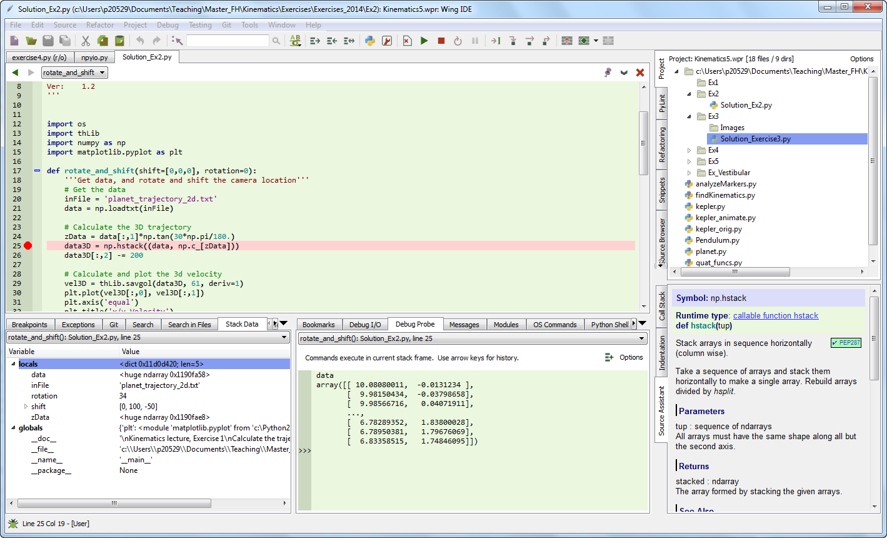
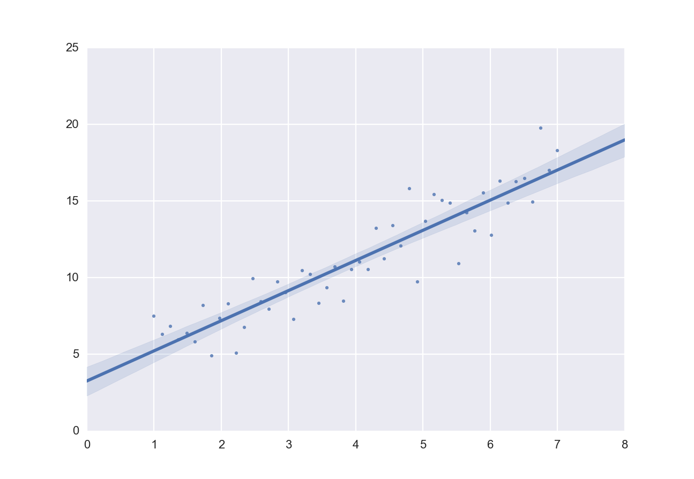

.. index:: Python

Getting Started
---------------

There are three reasons why I have decided to use Python for this
lecture.

#. It is the most elegant programming language that I know.

#. It is free.

#. It is powerful.

I have not seen many books on Python that I really liked. My favorite
introductory book is .

There are also many tutorials available on the internet (see links
below). Personally, most of the time I just google; thereby I stick
primarily a) to the official pages, and b) to http://stackoverflow.com/.
Also, I have found user groups surprisingly active and helpful!

Python Links
~~~~~~~~~~~~

-  `Python Scientific Lecture
   Notes. <http://scipy-lectures.github.com>`__ If you don't read
   anything else, read this!

-  `NumPy for Matlab
   Users <http://www.scipy.org/NumPy_for_Matlab_Users>`__ Start here if
   you have Matlab experience.

-  `Lectures on scientific computing with
   Python. <https://github.com/jrjohansson/scientific-python-lectures>`__
   Great IPython notebooks, from JR Johansson!

-  `The Python tutorial. <http://docs.python.org/2/tutorial>`__ The
   official introduction.

Free Python Books
~~~~~~~~~~~~~~~~~

-  `A Byte of Python. <http://swaroopch.com/notes/python>`__ Free book,
   very good at the introductory level.

-  `Learn Python the Hard Way, 3rd
   Ed <http://learnpythonthehardway.org/book/>`__ A popular, free book
   that you can work through.

-  `ThinkPython. <http://www.greenteapress.com/thinkpython>`__ Free
   book, for advanced programmers.

-  `Introduction to Python for Econometrics, Statistics and Data
   Analysis
   (pdf) <http://www.kevinsheppard.com/images/0/09/Python_introduction.pdf>`__
   by Kevin Sheppard: A good free book, which introduces Python with a
   focus on statistics.

Installation and Updates
~~~~~~~~~~~~~~~~~~~~~~~~

In general, I suggest that you start out by installing a Python
distribution which includes the most important libraries. Unless you
have a specific requirement for 64-bit versions, I recommend that you
install a 32-bit version of Python: it facilitates many activities that
require compilation of module parts, e.g. for Bayesian statistics
(PyMC), or when you want to speed up your programs with Cython. Since
all the Python packages required for this course are now available for
Python 3.x, I will use primarily Python 3 for this book. However, all
the scripts included should also work for Python 2.7. My favorite Python
distributions are

#. `WinPython <https://winpython.github.io/>`__ No admin-rights
   required. Recommended for Windows users.

#. `anaconda <https://store.continuum.io/cshop/anaconda/>`__ From
   Continuum. For Windows, Mac, and Linux.

which are very good starting points when you are using Windows.
*winpython* does not require administrator rights, and *anaconda* is a
more recent distribution, which is free for educational purposes.

Mac and Unix users should check out the `installations tips from
Johansson <https://github.com/jrjohansson/scientific-python-lectures>`__.

PyPI - the Python Package Index
~~~~~~~~~~~~~~~~~~~~~~~~~~~~~~~

If you decide to install things manually, you need the following modules
in addition to the Python standard library (in brackets I give the
version number with which the code provided here was tested):

-  *ipython 2.3.0* ... For interactive work.

-  *numpy 1.9.1* ... For working with vectors and arrays.

-  *scipy 0.14.1* ... All the essential scientific algorithms, including
   those for statistics.

-  *matplotlib 1.4.2* ... The de-facto standard module for plotting and
   visualization.

-  *pandas 0.15.2* ... Adds *DataFrames* (imagine powerful spreadsheets)
   to Python.

-  *patsy 0.3.0* ... For working with statistical formulas.

-  *statsmodels 0.6.1* ... For statistical modeling and advanced
   analysis.

-  *seaborn 0.5.1* ... For visualization of statistical data.

-  *PyMC 2.3.4* ... For Bayesian statistics, including Markov chain
   Monte Carlo simulations.

-  *scikits.bootstrap 0.3.2* ... Provides bootstrap confidence interval
   algorithms for scipy.

The `Python Package Index (*PyPI*) <https://pypi.python.org/pypi>`__ is
a repository of software for the Python programming language. There are
currently 53955 packages here!

To use a package from this index you simply can use

::

        pip install [package]

and to update packages

::

        pip install [package] -U

To get a list of all the Python packages installed, type

::

        pip list

IPython
-------

.. index:: IPython

.. image:: ../Images/ipython-qtconsole.png
    :scale: 75%

*The "ipython qtconsole" provides a powerful and flexible interactive
work environment.*

Make sure that you have a good programming environment! Currently, my
favorite way of programming is similar to my old Matlab style: I first
get the individual steps worked out interactively in an
`ipython <http://ipython.org/>`__ *qtconsole*. Ipython provides
interactive computing with Python, similar to the commandline in Matlab.
It comes with a command history, interactive data visualization, command
completion, and a lot of features that make it quick and easy to try out
code. When ipython is started in *pylab mode* (which is the typical
configuration), it automatically loads numpy and matplotlib.pyplot into
the active workspace, and provides a very convenient, Matlab-like
programming environment.

A very helpful new addition is the browser-based *ipython notebook*,
with support for code, text, mathematical expressions, inline plots and
other rich media. Please check out the links to the ipython notebooks in
this statistics introduction. I believe that it will help you to get up
to speed with python much more quickly.

Personalizing IPython
~~~~~~~~~~~~~~~~~~~~~

When working on a new problem, I always start out with IPython. Once I
have the individual steps working, I use the IPython command *%history*
to get the commands I have used, and switch to an integrated development
environment (typically *Wing* or *Spyder*).

To start up IPython quickly in the location and with the configuration I
like, I use the following tricks (the following are the steps on MS
Windows, but should be easy to adapt to other operating systems):

To personalize ipython, generate your own profile:

-  run "cmd"

-  In the newly created command shell, execute the following command

   ::

                   ipython profile create $<myName>$
               

   (This generates a folder
   :math:`.ipython \backslash profile\_<myName> \backslash startup"`)

-  Into this folder, place a file with e.g. the name
   :math:`00\_<myName>.py`, containing

   ::

               import pandas as pd
               import os
               os.chdir(r'C:\<your_favorite_dir>')"
               

-  Generate a file "ipython.bat" in your startup-directory, containing

   ::

             [Python-directory]\backslash Scripts \backslash ipython3 qtconsole --profile <myName> --pylab=inline
             

Now you can start "your" ipython by just typing "ipython" in the Windows
run command

To see all ipython notebooks for the course, do the following:

-  run "cmd"

-  Run the commands

   ::

         cd [ipynb-directory]
         [Python-directory]\backslash Scripts \backslash ipython3.exe notebook --pylab=inline
         

IPython Tips
~~~~~~~~~~~~

#. Use pylab: ``ipython qtconsole —pylab=inline``

#. For help on e.g. ``plot``, use ``plot?`` or ``help(plot)``.

#. Check out the help tips when you start ipython.

#. Customize ipython on your computer: it will save you time in the long
   run!

#. TAB-completion, for file- and directory names, variable names, AND
   for commands

#. To switch between inline and external graphs, use
   ``%matplotlib inline`` and ``%matplotlib qt4``

#. Use ``%runfile [aFile]`` to run a file, and ``import [aFile]`` to
   import it

Developing Python Programs
--------------------------

*"Wing" is my favorite development environment, with probably the best
existing debugger for Python.*

To write a program, I typically take the commands I have worked out in
ipython with *%history*, and take them to an IDE (integrated development
environment): I either use *Wing* (my clear favorite Python IDE,
although it is commercial) or *Spyder* (which is good and free).
*PyCharm* is another IDE with a good debugger, and has very good
vim-emulation.

.. image:: ../Images/spyder-screenshot.jpg
    :scale: 33%

*"Spyder" is a very good, free IDE.*

Python Tips
~~~~~~~~~~~

#. Stick to the standard conventions.

   -  Every function has a docu-string.

   -  | ``import matplotlib.pyplot as plt``
      | ``import numpy as np``
      | ``import scipy as sp``
      | ``import pandas as pd``
      | ``import seaborn as sns``

#. To get the current directory, use ``os.path.abspath(os.curdir)``.

#. Everything in Python is an object: to find out about "obj", use
   ``type(obj)`` and ``dir(obj)``.

#. Learn to use the debugger.

#. Know *lists*, *tuples*, and *dictionaries*; also, know about *numpy
   arrays* and *pandas DataFrames*.

#. Use functions a lot, and understand the ``if __name__=="__main__":``
   construct.

Python Data Structures
~~~~~~~~~~~~~~~~~~~~~~

Tuple ()
    A collection of different things. Cannot be modified after creation.

List [
    ] A collection of similar things. Does not care if those are numbers
    or strings.

Array [
    ] Vectors and matrices, for numerical data manipulation. Defined in
    *numpy*.

Dictionary {}
    Dictionaries are unordered *(key/value)* collections of content,
    where the content is addressed as *dict["key"]* (see example below).

DataFrame
    Data structure optimized for working with named, statistical data.
    Defined in *pandas*. (See next chapter.)

::

        In [1]: myTuple = ('abc', np.arange(0,3,0.2), 2.5)

        In [2]: myTuple[2]
        Out[2]: 2.5

        In [3]: myList = ['abc', 'def', 'ghij']

        In [4]: myList.append('klm')

        In [5]: myList2 = [1,2,3]

        In [6]: myList3 = [4,5,6]

        In [7]: myList2 + myList3
        Out[7]: [1, 2, 3, 4, 5, 6]

        In [8]: myArray = np.array(myList2)

        In [9]: myArray2 = np.array(myList3)

        In [10]: myArray + myArray2
        Out[10]: array([5, 7, 9])

        In [11]: myDict = dict(one=1, two=2, info='some information')

        In [12]: myDict2 = {'ten':1, 'twenty':20, 'info':'more information'}

        In [13]: myDict['info']
        Out[13]: 'some information'

        In [14]: myDict.keys()
        Out[14]: dict_keys(['one', 'info', 'two'])

Matplotlib, pylab, and pyplot: how are they related?
----------------------------------------------------
.. index:: Matplotlib

.. index:: pylab

.. index:: pyplot

The flexibility of Python has the "disadvantage" that it can come in
different flavors or coding styles. When you know the different
approaches, they are great to use. But when you get started, it can be a
bit confusing. The following section from the Matplotlib documentation
may help to clarify these things:

**Matplotlib** is the whole package; *pylab* is a Matlab-like module in
matplotlib that gets installed alongside matplotlib; and
*matplotlib.pyplot* is a module in matplotlib.

**Pyplot** provides the state-machine interface to the underlying
plotting library in matplotlib. This means that figures and axes are
implicitly and automatically created to achieve the desired plot. For
example, calling *plot* from pyplot will automatically create the
necessary figure and axes to achieve the desired plot. Setting a *title*
will then automatically set that title to the current axes object:

::

        import matplotlib.pyplot as plt

        plt.plot(np.arange(10))
        plt.title("Simple Plot")
        plt.show()

**Pylab** combines the pyplot functionality (for plotting) with the
numpy functionality (for mathematics and for working with arrays) in a
single namespace, making that namespace (or environment) even more
MATLAB-like. For example, one can call the sin and cos functions just
like you could in MATLAB, as well as having all the features of pyplot.

The pyplot interface is generally preferred for non-interactive plotting
(i.e., scripting). The pylab interface is convenient for interactive
calculations and plotting, as it minimizes typing. Note that this is
what you get if you use the ipython shell with the -pylab option, which
imports everything from pylab and makes plotting fully interactive.

Coding Styles in Python
-----------------------

In Python you will find different coding styles and usage patterns.
These styles are all perfectly valid, and each have their pros and cons.
Just about all of the examples can be converted into another style and
achieve the same results. The only caveat is to avoid mixing the coding
styles for your own code.

Of the different styles, there are two that are officially supported.
Therefore, these are the preferred ways to use matplotlib.

For the preferred pyplot style, the imports at the top of your scripts
will typically be:

::

        import matplotlib.pyplot as plt
        import numpy as np

Then one calls, for example, np.arange, np.zeros, np.pi, plt.figure,
plt.plot, plt.show, etc. So, a simple example in this style would be:

::

        import matplotlib.pyplot as plt
        import numpy as np
        x = np.arange(0, 10, 0.2)
        y = np.sin(x)
        plt.plot(x, y)
        plt.show()

Note that this example used pyplot"s state-machine to automatically and
implicitly create a figure and an axes. For full control of your plots
and more advanced usage, use the pyplot interface for creating figures,
and then use the object methods for the rest:

::

        import matplotlib.pyplot as plt
        import numpy as np
        x = np.arange(0, 10, 0.2)
        y = np.sin(x)
        fig = plt.figure()
        ax = fig.add_subplot(111)
        ax.plot(x, y)
        plt.show()

Next, the same example using a pure MATLAB-style:

::

        from pylab import *
        x = arange(0, 10, 0.2)
        y = sin(x)
        plot(x, y)

So, why all the extra typing as one moves away from the pure
MATLAB-style? For very simple things like this example, the only
advantage is academic: the wordier styles are more explicit, more clear
as to where things come from and what is going on. For more complicated
applications, this explicitness and clarity becomes increasingly
valuable, and the richer and more complete object-oriented interface
will likely make the program easier to write and maintain.

Here an example, to get you started with Python. For interactive work,
it is simplest to use the *pylab mode*, as shown in the example below.

Example-Session
~~~~~~~~~~~~~~~

"gettingStarted.py" (p ) gives a short demonstration of Python for
scientific data analysis.

Pandas
------

.. index:: pandas

`pandas <http://pandas.pydata.org/.>`__ is a Python module which
provides suitable data structures for statistical analysis. It
significantly enhances the abilities of Python for data input, data
organization, and data manipulation. In the following, I assume that
pandas has been imported with

::

        import pandas as pd

A good introduction to pandas can be found under
http://www.randalolson.com/2012/08/06/statistical-analysis-made-easy-in-python/

Data Input
~~~~~~~~~~

Pandas offers tools for reading and writing data between in-memory data
structures and different formats, e.g. CSV and text files, Microsoft
Excel, and SQL databases. For example, if you have data in your
clipboard, you can import them directly with

::

        data = pd.read_clipboard()

Or data from "Sheet1" in an Excel-file "data.xls" can be read in easily
with

::

        xls = pd.io.parsers.ExcelFile('data.xls')
        data = xls.parse('Sheet1')

**Example:** "readZip.py" (p ) This advanced script shows you how you
can directly import data from an MS-Excel file from a zipped archive on
the web.

Data Handling and Manipulation
~~~~~~~~~~~~~~~~~~~~~~~~~~~~~~

To handle labeled data, pandas introduces *DataFrame* objects. A
DataFrame is a 2-dimensional labeled data structure with columns of
potentially different types. You can think of it like a spreadsheet or
SQL table. It is generally the most commonly used pandas object. At
first, handling data with Pandas feels a bit unusual. To get you
started, let me give you a specific example:

::

        import numpy as np
        import pandas as pd

        t = np.arange(0,10,0.1)
        x = np.sin(t)
        y = np.cos(t)

        df = pd.DataFrame({'Time':t, 'x':x, 'y':y})

In Pandas, rows are addressed through "indices", and columns through
their "column" name. To address the first column only, you have two
options:

::

        df.Time
        df['Time']

If you want to extract two columns at the same time, you have to use a
Python-list:

::

        data = df[['Time', 'y']]

To display the first or last rows, use

::

        data.head()
        data.tail()

For e.g. rows 5-10 (note that this are 6 numbers), use

::

        data[4:10]

as :math:`10-4=6`. (I know, the array indexing takes some time to get
used to. Just keep in mind that Python addresses the *locations between*
entries, not the entries, and that it starts at :math:`0`!!) To do this
in one go, use

::

        df[['Time', 'y']][4:10]

You can also apply the standard row/column notation, by using the method
"ix":

::

        df.ix[[0,2],4:10]

Finally, sometimes you want to have direct access to the data, not to
the DataFrame. You can do this with

::

        data.values

Pandas offers powerful functions to handle missing data and "nans", and
other kinds of data manipulation like pivoting. For example, you can use
data-frames to efficiently group objects, and do a statistical
evaluation of each group. The following data are simulated (but
realistic) data of a survey on how many hours a day people watch on the
TV, grouped into "m"ale and "f"emale responses:

::

        data = pd.DataFrame({
            'Gender': ['f', 'f', 'm', 'f', 'm', 'm', 'f', 'm', 'f', 'm'],
            'TV': [3.4, 3.5, 2.6, 4.7, 4.1, 4.0, 5.1, 4.0, 3.7, 2.1]
            })

        # Group the data
        grouped = data.groupby('Gender')

        # Get the groups as DataFrames
        df_female = grouped.get_group('f')

        # Get the corresponding numpy-array
        values_female = grouped.get_group('f').values

        # or equivalently
        groups = grouped.groups
        values_female = groups['f']

        # Do some overview statistics
        print(grouped.describe())

produces

::

                            TV
        Gender
        f      count  5.000000
               mean   4.080000
               std    0.769415
               min    3.400000
               25%    3.500000
               50%    3.700000
               75%    4.700000
               max    5.100000
        m      count  5.000000
               mean   3.360000
               std    0.939681
               min    2.100000
               25%    2.600000
               50%    4.000000
               75%    4.000000
               max    4.100000

For statistical analysis, pandas becomes really powerful if you combine
it with *statsmodels* (see below).

Statsmodels
-----------

.. index:: statsmodels

`statsmodels <http://statsmodels.sourceforge.net/.>`__ is a Python
module that provides classes and functions for the estimation of many
different statistical models, as well as for conducting statistical
tests, and statistical data exploration. An extensive list of result
statistics are available for each estimator. *statsmodels* also allows
the formulation of models with the popular formula language also used by
:math:`R`, the leading statistics package. For example, data on the
connection between academic "success", "intelligence" and "diligence"
can be described with the model

.. math:: success \sim intelligence * diligence

which would capture the direct effect of "intelligence" and "diligence",
as well as the interaction. You find more information on that topic in
the section "Statistical Models".

While for complex statistical models R still has an edge, python has a
much clearer and more readable syntax, and is arguably more powerful for
the data manipulation often required for statistical analysis.

"statsmodelsIntro.py" (p ) shows you how the combination of pandas and
statsmodels can be used for data analysis.

Seaborn
-------

.. index:: seaborn

`seaborn <http://statsmodels.sourceforge.net/.>`__ is a Python
visualization library based on matplotlib. Its primary goal is to
provide a concise, high-level interface for drawing statistical graphics
that are both informative and attractive.

::

            x = linspace(1, 7, 50)
            y = 3 + 2*x + 1.5*randn(len(x))
            sns.regplot(x,y)

already produces a nice and informative regression plot (Fig.
below).

*Regression plot, from "seaborn", with a substantial amount of added
information.*

Exercises
---------

-  Read in data from different sources:

   -  A CVS-file with a header ("Data\\data_kaplan\\swim100m.csv")

   -  An MS-Excel file ("Data/data_others/Table 6.6 Plant experiment.xls")

   -  Data from the WWW (see "readZip.py" [py:readZip])

-  

   -  Generate a pandas dataframe, with the x-column time stamps from 0
      to 10 sec, at a rate of 10 Hz, the y-column data values with a
      sine with 1.5 Hz, and the z-column the corresponding cosine
      values. Label the x-column "Xvals", and the y-column "YVals", and
      the z-column "ZVals".

   -  Show the head of this dataframe

   -  Extract the data in lines 10-15 from "Yvals" and "ZVals", and
      write them to the file "out.txt".

.. |ipynb| image:: ../Images/IPython.jpg
    :scale: 50 % 
.. |python| image:: ../Images/python.jpg
    :scale: 50 % 

