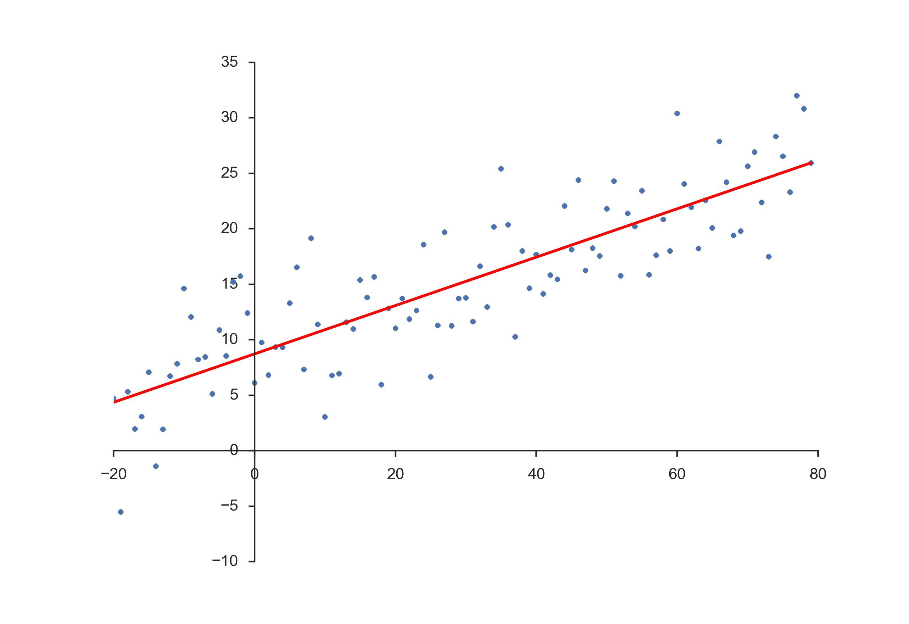

.. image:: ..\Images\title_relations.png
    :height: 100 px

.. Relation Between Two Continuous Variables
.. =========================================

If we have two related variables, the *correlation* measures the
association between the two variables. In contrast, a *linear
regression* is used for the prediction of the value of one variable from
another. If we want to compare more than two groups of variables, we
have to use a technique known as *Analysis of Variance (ANOVA)*.

Correlation
-----------

.. index:: correlation

Correlation Coefficient
~~~~~~~~~~~~~~~~~~~~~~~

.. index:: correlation coefficient

If the two variables are normally distributed, the standard measure of
determining the *correlation coefficient*, often ascribed to *Pearson* ,
is

.. math::

   \label{eq:pearson}
     r = \frac{\sum\limits_{i=1}^n (X_i - \bar{X})(Y_i - \bar{Y})}{\sqrt{\sum\limits_{i=1}^n (X_i - \bar{X})^2} \sqrt{\sum\limits_{i=1}^n (Y_i - \bar{Y})^2}}

With

.. math::
  s_{xy} = \frac{\sum\limits_{i=1}^n (X_i - \bar{X})(Y_i - \bar{Y})}{n-1}

and :math:`s_x, s_y` the sample standard deviations of the *x* and *y* values, respectively, this can also be written as

.. math::

  r = \frac{s_{xy}}{s_x \cdot s_y}.

Pearson's correlation coefficient, sometimes also referred to as *population correlation coefficient* or *sample correlation*, can take any value from -1 to +1. Examples are given in the Figure below. Note that the formula for the correlation coefficient is symmetrical between *x* and *y*.

Coefficient of determination
^^^^^^^^^^^^^^^^^^^^^^^^^^^^

.. index:: coefficient of determination

The *coefficient of determination*  or :math:`R^2` is the square of the correlation. It is easier to interpret than the correlation coefficient r: Values of :math:`R^2` close to 1 are good, values close to 0 are poor. To explain the interpretation of :math:`R^2`, let us look at the math more formally:

.. image:: ../Images/Coefficient_of_Determination.png
    :scale: 75 %

*The better the linear regression (on the right) fits the data in comparison to the simple average (on the left graph), the closer the value of* :math:`R^2` *is to one. The areas of the blue squares represent the squared residuals with respect to the linear regression. The areas of the red squares represent the squared residuals with respect to the average value (from Wikipedia)*

A data set has values :math:`y_i`, each of which has an associated modelled value :math:`f_i` (also sometimes referred to as :math:`\hat{y}_i`). Here, the values :math:`y_i` are called the *observed values* and the modelled values :math:`f_i` are sometimes called the *predicted values*.

In the following :math:`\bar{y}` is the mean of the observed data:

.. math::
    \bar{y}=\frac{1}{n}\sum_{i=1}^n y_i 

where n is the number of observations.

The "variability" of the data set is measured through different sums of squares:

    :math:`SS_\text{tot}=\sum_i (y_i-\bar{y})^2`, the total sum of squares (proportional to the sample variance);

    :math:`SS_\text{reg}=\sum_i (f_i -\bar{y})^2`, the regression sum of squares, also called the explained sum of squares.

    :math:`SS_\text{res}=\sum_i (y_i - f_i)^2\,`, the sum of squares of residuals, also called the residual sum of squares.

The notations :math:`SS_{R}` and :math:`SS_{E}` should be avoided, since in some texts their meaning is reversed to "Residual sum of squares" and "Explained sum of squares", respectively.

The most general definition of the coefficient of determination is

.. math::
    R^2 \equiv 1 - {SS_{\rm res}\over SS_{\rm tot}}.\,

**Relation to unexplained variance**

In a general form, :math:`R^2` can be seen to be related to the unexplained variance, since the second term compares the unexplained variance (variance of the model's errors) with the total variance (of the data). See fraction of variance unexplained.

**Adjusted** :math:`R^2`

For multiple regression, the *adjusted* :math:`R^2` value (written as :math:`\bar{R}^2`) is often used instead of :math:`R^2`:

.. math::
      \bar{R}^2 = 1 - (1 - R^2)\frac{n - 1}{n - p - 1}

where *n* is the sample size and *p* is the number of independent variables.

**Examples**

How large :math:`R^2` or :math:`\bar{R}^2` must be to be considered good depends on the discipline. They are usually expected to be larger in the physical sciences than it is in biology or the social sciences. In finance or marketing, it also depends on what is being modeled.

Caution: the sample correlation and :math:`R^2` are misleading if there is a nonlinear relationship between the independent and dependent variables!

| |image26|

*Several sets of (x, y) points, with the correlation coefficient of x and y for each set.
Note that the correlation reflects the non-linearity and direction of a linear relationship (top
row), but not the slope of that relationship (middle), nor many aspects of nonlinear relationships
(bottom). N.B.: the Fiure in the center has a slope of 0 but in that case the correlation
coefficient is undefied because the variance of Y is zero. (From: Wikipedia)*

Rank correlation 
~~~~~~~~~~~~~~~~~~

.. index:: rank correlation

If the data distribution is not normal, a different approach is
necessary. In that case one can rank the set of subjects for each
variable and compare the orderings. There are two commonly used methods
of calculating the rank correlation.

- *Spearman's* :math:`\rho`, which is exactly the same as the Pearson
   correlation coefficient :math:`r` calculated on the ranks of the
   observations.

- *Kendall's* :math:`\tau`. is also a rank correlation coefficient,
  measuring the association between two measured quantities. It is
  harder to calculate than Spearman's rho, but it has been argued that
  confidence intervals for Spearman's rho are less reliable and less
  interpretable than confidence intervals for Kendall's tau-parameters.

Regression
----------

.. index:: regression

General linear regression model
~~~~~~~~~~~~~~~~~~~~~~~~~~~~~~~

.. index:: regression-linear

We can use the method of *regression* when we want to predict the value
of one variable from the other.

| |image27|

*Linear regression. (From Wikipedia)*

When we search for the best-fit line to a given :math:`(x_i,y_i)`
dataset, we are looking for the parameters :math:`(k,d)` which minimize
the sum of the squared *residuals* :math:`\epsilon_i` in

.. math::

   \label{eq:simpleRegression}
     y_i = k * x_i + d + \epsilon_i

where :math:`k` is the *slope* or *inclination* of the line, and
:math:`d` the *intercept*. This is in fact just the one-dimensional
example of the more general technique, which is described in the next
section. Note that in contrast to the correlation, this relationship
between :math:`x` and :math:`y` is no more symmetrical: it is assumed
that the :math:`x-`\ values are known exactly, and that all the
variability lies in the residuals.

Simple Regression
~~~~~~~~~~~~~~~~~

Example of *simple linear regression* with 7 observations. Suppose there
are 7 data points :math:`\left\{ {{y_i},{x_i}} \right\}`, where
:math:`i=1,2,…,7`. The simple linear regression model is

.. math:: y_i = \beta_0 + \beta_1 x_i +\epsilon_i, \,

where :math:`\beta_0` is the y-intercept and :math:`\beta_1` is the
slope of the regression line. This model can be represented in matrix
form as

.. math::

   \begin{bmatrix}y_1 \\ y_2 \\ y_3 \\ y_4 \\ y_5 \\ y_6 \\ y_7 \end{bmatrix}
     =
     \begin{bmatrix}1 & x_1  \\1 & x_2  \\1 & x_3  \\1 & x_4  \\1 & x_5  \\1 & x_6 \\ 1 & x_7  \end{bmatrix}
     \begin{bmatrix} \beta_0 \\ \beta_1  \end{bmatrix}
     +
     \begin{bmatrix} \epsilon_1 \\ \epsilon_2 \\ \epsilon_3 \\ \epsilon_4 \\ \epsilon_5 \\ \epsilon_6 \\ \epsilon_7 \end{bmatrix}

where the first column of ones in the design matrix represents the
y-intercept term while the second column is the x-values associated with
the y-value.

Design Matrix
~~~~~~~~~~~~~

.. index:: design matrix

Quadratic Fit
^^^^^^^^^^^^^

The equation for a quadratic fit to the given data is

.. math:: y_i = \beta_0 + \beta_1 x_i + \beta_2 x_i^2 +\epsilon_i, \,

This can be rewritten in matrix form:

.. math::

  \begin{bmatrix}y_1 \\ y_2 \\ y_3 \\ y_4 \\ y_5 \\ y_6 \\ y_7 \end{bmatrix}
  =
  \begin{bmatrix}1 & x_1 & x_1^2 \\1 & x_2  & x_2^2 \\1 & x_3  & x_3^2 \\1 & x_4  & x_4^2 \\1 & x_5  & x_5^2 \\1 & x_6  & x_6^2 \\ 1 & x_7  & x_7^2 \end{bmatrix}
  \begin{bmatrix} \beta_0 \\ \beta_1  \\ \beta_2 \end{bmatrix}
  +
  \begin{bmatrix} \epsilon_1 \\ \epsilon_2 \\ \epsilon_3 \\ \epsilon_4 \\ \epsilon_5 \\ \epsilon_6 \\ \epsilon_7 \end{bmatrix}

General Formulation
^^^^^^^^^^^^^^^^^^^

In general,this can be rewritten in matrix form as:

.. math:: y=X\beta+ \epsilon,

the matrix :math:`X` is the *design matrix*.

:math:`Y` is a vector of dimension :math:`(n \times 1)` and is called the endogenous variable, :math:`X` is a
matrix of dimension :math:`(n \times k)` where each colum is  an explanatory variable and :math:`\varepsilon`
is the error term. :math:`\beta` is the vector of dimension :math:`(k \times 1)` and contains the parameters we
want to estimate.

| |image28|

*Best-fit linear regression line (red) and residuals (black).*

Coding
~~~~~~

If you have vectors *x,y* containing your data, you can use *statsmodels* to create a design matrix that also
includes the *1's* for the offset:

::

    import statsmodels.api as sm
    Xmat = sm.add_constant(x)

The parameters are then easily found as

::

    params = np.linalg.lstsq(Xmat, y)

However, you get a lot more information if you use the OLS-fit from *statmodels*:

::

    import numpy as np
    import statsmodels.api as sm

    # Generate artificial data
    nobs = 100
    X = np.random.random(nobs)
    X = sm.add_constant(X)
    beta = [5, 3.5]
    e = np.random.random(nobs)
    y = np.dot(X, beta) + e

    # Fit regression model
    results = sm.OLS(y, X).fit()

    # Inspect the results
    print(results.summary())

yields the following results:

::

                            OLS Regression Results
    ==============================================================================
    Dep. Variable:                      y   R-squared:                       0.923
    Model:                            OLS   Adj. R-squared:                  0.922
    Method:                 Least Squares   F-statistic:                     1173.
    Date:                Fri, 04 Jul 2014   Prob (F-statistic):           2.45e-56
    Time:                        14:49:08   Log-Likelihood:                -15.390
    No. Observations:                 100   AIC:                             34.78
    Df Residuals:                      98   BIC:                             39.99
    Df Model:                           1
    ==============================================================================
                     coef    std err          t      P>|t|      [95.0% Conf. Int.]
    ------------------------------------------------------------------------------
    const          5.4410      0.059     92.685      0.000         5.324     5.557
    x1             3.5718      0.104     34.250      0.000         3.365     3.779
    ==============================================================================
    Omnibus:                       21.620   Durbin-Watson:                   2.302
    Prob(Omnibus):                  0.000   Jarque-Bera (JB):                5.798
    Skew:                           0.223   Prob(JB):                       0.0551
    Kurtosis:                       1.908   Cond. No.                         4.60
    ==============================================================================

The meaning of many of these parameters is described in the chapter on "Statistical Models".

From the *results*, you can extract e.g. the model parameters, standard errors, confidence intervals, and residuals:

::

    params = results.params
    std_err = results.bse
    ConfInt = results.conf_int()
    residuals = results.resid

Assumptions
~~~~~~~~~~~

To use the technique of linear regression, the following assumptions should be
fulfilled:

1. The *independent variables* (i.e. *x*) are exactly known.
2. Validity. Most importantly, the data you are analyzing should map to the research question you are trying to answer. This sounds obvious but is often overlooked or ignored because it can be inconvenient. For example, a linear regression does not properly describe a quadratic curve.
3. Additivity and linearity. The most important mathematical assumption of the regression model is that its deterministic component is a linear function of the separate predictors.
4. Independence of errors.
5. Equal variance of errors.
6. Normality of errors.

|ipynb| `80_multivariate.ipynb <http://nbviewer.ipython.org/url/raw.github.com/thomas-haslwanter/statsintro/master/ipynb/80_multivariate.ipynb>`_

|python| `multivariate.py <https://github.com/thomas-haslwanter/statsintro/blob/master/Code3/multivariate.py>`_

| |image29|

*The sets in the Anscombe's quartet have the same linear regression line but are
themselves very different.*

| |image30|

*Regression, with confidence intervals for the mean, as well as for the
predicted data. The red dotted line shows the confidence interval for the mean;
and the green dotted line the confidence interval for predicted data. (This can
be compared to the standard error and the standard deviation for a population.)*

Since to my knowledge there exists no program in the Python standard
library (or numpy, scipy) to calculate the confidence intervals for a
regression line, I include my corresponding program *fitLine.py*.
The output of this program is shown in the figure below.
This program also shows how Python programs intended for
distribution should be documented.

Exercises
---------

#. **Correlation**

    Read in the data for the average yearly temperature at the Sonnblick, from     *https://github.com/thomas-haslwanter/statsintro/blob/master/Data/data\_others/AvgTemp.xls*
    Calculate the Pearson and Spearman correlation, and Kendall's tau, for the temperature vs. year.

#. **Regression**

    For the same data, calculate the yearly increase in temperature, assuming a linear increase with time.
    Is this increase significant?

#. **Normality Check**

    For the data from the regression model, check if the model is ok by testing if the residuals are normally distributed (e.g. by using the Komogorov-Smirnov test)

|python| `fitLine.py <https://github.com/thomas-haslwanter/statsintro/blob/master/Code3/fitLine.py>`_

.. [4]
   This section has been taken from Wikipedia

.. |image24| image:: ../Images/Sensitivity_Specificity.png
    :scale: 50 %
.. |image25| image:: ../Images/Sensitivity_Specificity_Example.png
    :scale: 50 %
.. |image26| image:: ../Images/Correlation_examples2.png
    :scale: 50 %

.. |image28| image:: ../Images/residuals_linreg.png
    :scale: 50 %
.. |image29| image:: ../Images/Anscombes_quartet.png
    :scale: 50 %
.. |image30| image:: ../Images/regression_wLegend.png
    :scale: 50 %

.. |ipynb| image:: ../Images/IPython.jpg
    :scale: 50 % 
.. |python| image:: ../Images/python.jpg
    :scale: 50 % 
