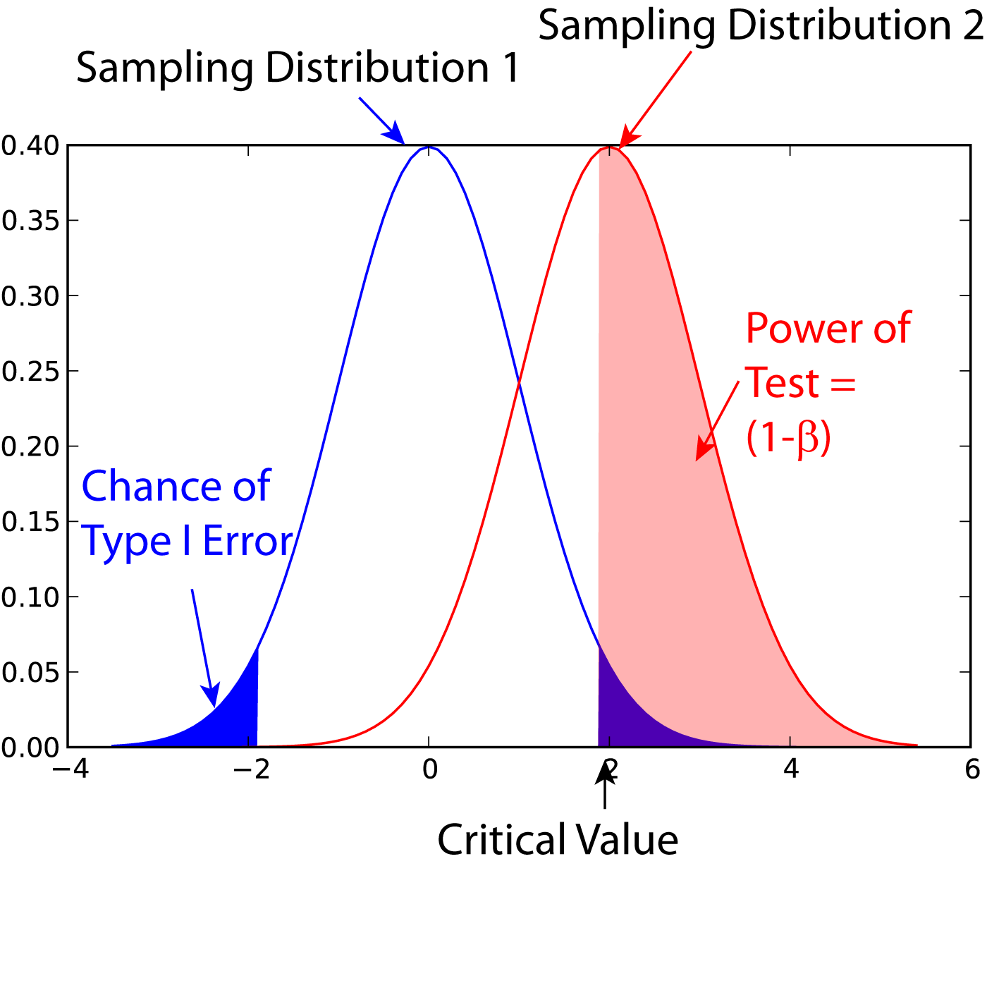
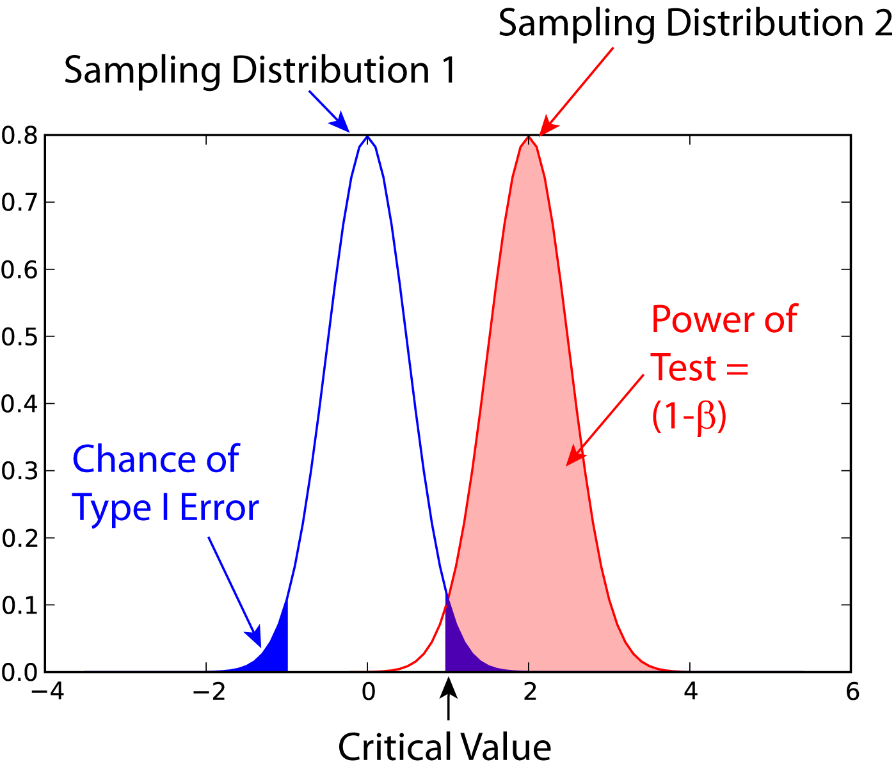

.. image:: ..\Images\title_tests.png
    :height: 100 px

.. Statistical Tests 
.. ===================

Hypothesis tests
----------------

Statistical evaluations are based on the initially
often counterintuitive procedure of *hypothesis tests*. A hypothesis
test is a standard format for assessing statistical evidence. It is
ubiquitous in scientific literature, most often appearing in the form of
statements of *statistical significance* and quotations like
:math:`"p<0.01"` that pepper scientific journals. Thereby you proceed as
follows: you

-  state your hypothesis.

-  decide which value you want to test your hypothesis on.

-  calculate the *probability p* that you find the given value, assuming
   that your hypothesis is true

The first hypothesis is referred to as *null-hypothesis*, since we
assume that there is *null* difference between the hypothesis and the
result. The found probability for a specific target value is the
*p-value* that you typically find in the literature. If :math:`p<0.05`,
the difference between your sample and the value that you check is
*significant*. If :math:`p<0.001`, we speak of a *highly significant*
difference.

**Example 1:**  Let us compare the weight of two groups of subject. Then the
*null hypothesis* is that there is *null* difference in the weight
between the two groups. If a statistical comparison of the weight produces a
p-value of 0.03, this means that "the probability that the null hypothesis
is correct is 0.03, or 3\%". Since this probability is quite low, we say that
"there is a significant difference between the weight of the two groups".

**Example 2:** If we want to check the assumption that the mean value of a group
is 7, then the null hypothesis would be: "We assume that there is null
difference between the mean value in our population and the value 7."

Types of Error
~~~~~~~~~~~~~~~

In hypothesis testing, two types of errors can occur:

Type I errors
^^^^^^^^^^^^^

These are errors, where you get a significant result despite the fact
that the hypothesis is true. The likelihood of a Type I error is
commonly indicated with :math:`\alpha`, and *is set before you start the
data analysis*.

For example, assume that the population of young Austrian adults has a
mean IQ of 105 (i.e. we are smarter than the rest) and a standard
deviation of 15. We now want to check if the average FH student in Linz
has the same IQ as the average Austrian, and we select 20 students. We
set :math:`\alpha=0.05`, i.e. we set our significance level to 95%. Let
us now assume that the average student has in fact the same IQ as the
average Austrian. If we repeat our study 20 times, we will find one of
those 20 times that our sample mean is significantly different from the
Austrian average IQ. Such a finding would be a false result, despite the
fact that our assumption is correct, and would constitute a *type I
error*.

Type II errors and Test Power
^^^^^^^^^^^^^^^^^^^^^^^^^^^^^

If we want to answer the question "How much chance do we have to reject
the null hypothesis when the alternative is in fact true?" Or in other
words, "What’s the probability of detecting a real effect?" we are faced
with a different problem. To answer these questions, we need an
*alternative hypothesis*.

For the example given above, an *alternative hypothesis* could be: "We
assume that our population has a mean value of 6."

A *Type II error* is an error, where you do *not* get a significant
result, despite the fact that the null-hypothesis is false. The
probability for this type of error is commonly indicated with
:math:`\beta`. The *power* of a statistical test is defined as
:math:`(1-\beta)*100`, and is the chance of correctly accepting the
alternate hypothesis. Figure [fig:power1] shows the meaning of the
*power* of a statistical test. Note that for finding the power of a
test, you need an alternative hypothesis.

Sample Size
~~~~~~~~~~~

The power of a statistical test depends on four factors:

#. :math:`\alpha`, the probability for Type I errors

#. :math:`\beta`, the probability for Type II errors (
   :math:`\Rightarrow` power of the test)

#. :math:`d`, the *effect size*, i.e. the magnitude of the investigated effect relative to
   :math:`\sigma`, the standard deviation of the sample

#. :math:`n`, the sample size

Only 3 of these 4 parameters can be chosen, the :math:`4^{th}` is then
automatically fixed.

The size of the absolute difference *D* between mean treatment outcomes
that will answer the clinical question being posed is often called
*clinical significance* or *clinical relevance*.

| |image21|

*Power of a statistical test, for comparing the mean value of two given distributions.*

| |image22|

*Eect of an increase in sampling size on the power of a test.*

Examples for some special cases 
^^^^^^^^^^^^^^^^^^^^^^^^^^^^^^^^^
 
**Test on one mean:** if we have the hypothesis that the data population has
a mean value of :math:`x_1` and a standard deviation of :math:`\sigma`, and the actual
population has a mean value of :math:`x_1+D` and the same standard deviation, we
can find such a difference with a *minimum sample number* of

.. math:: n = \frac{{({z_{1 - \alpha /2}} + {z_{1 - \beta }})}^2}{d^2}

Here z is the standardized normal variable (see also chapter
"Normal Distribution")

.. Math:: z = \frac{x-\mu}{\sigma} .

and :math:`d = \frac{D}{\sigma}` the effect size.

In words, if the real mean has a value of :math:`x_1`, we want to detect this
correctly in at least :math:`1-\alpha\%` of all tests; and if the real mean is
shifted by :math:`D` or more, we want to detect this with a likelihood of at least
:math:`1-\beta\%`.

**Test between two different populations:**

For finding a difference between two normally distributed means, the
minimum number of samples we need in each group to detect an absolute difference *D* is

.. math:: {n_1} = {n_2} = \frac{{({z_{1 - \alpha /2}} + {z_{1 - \beta }})}^2(\sigma _1^2 + \sigma _2^2)}{D^2} .

Programs: SampleSize 
^^^^^^^^^^^^^^^^^^^^^^

|python| `sampleSize.py <https://github.com/thomas-haslwanter/statsintro/blob/master/Code3/sampleSize.py>`_

The "p-value fallacy"
~~~~~~~~~~~~~~~~~~~~~

p values are often used to measure evidence against a hypothesis.
Unfortunately, they are often incorrectly viewed as an error probability
for rejection of the hypothesis, or, even worse, as the posterior
probability (i.e. after the data have been collected) that the
hypothesis is true. As an example, take the case where the alternative
hypothesis is that the mean is just a fraction of one standard deviation
larger than the mean under the null hypothesis: in that case, a sample
that produces a p-value of 0.05 may just as likely be produced if the
the alternative hypothesis is true as if the null hypothesis is true!

Sellke et al (2001) have investigated this question in detail, and recommend to use a
"calibrated p-value" to estimate the probability of making a mistake
when rejecting the null hypothesis, when the data produce a p-value
:math:`p`:

.. math::

   \label{eq:pFallacy}
       \alpha(p)= \frac{1}{1 + \frac{1}{-e \; p \; log(p)}}

with :math:`e=exp(1)`, and :math:`log` the natural logarithm. For
example, :math:`p=0.05` leads to :math:`\alpha=0.29`, and :math:`p=0.01`
to :math:`\alpha=0.11`.

Remember, p only indicates the likelihood of obtaining a certain value
for the test statistic if the null hypothesis is true - nothing else!

And keep in mind that improbable events do happen, even if not very
frequently. For example, back in 1980 a woman named Maureen Wilcox bought
tickets for both the Rhode Island lottery and the Massachusetts lottery. And
she got the correct numbers for both lotteries. Unfortunately for her, she
picked all the correct numbers for Massachusetts on her Rhode Island ticket,
and all the  right numbers for Rhode island on her Massachusetts ticket :(
Seen statistically, the p-value for such an event would be extremely small -
but it did happen anyway.

Sensitivity and Specificity 
-----------------------------

Some of the more confusing terms in statistical analysis are
*sensitivity* and *specificity* . A related topic are *positive
predictive value (PPV)* and *negative predictive value (NPV)* . The
following diagram shows how the four are related:

| |image23|

*Relationship between sensitivity, specicity, positive predictive value and negative
predictive value. (From: Wikipedia)*

-  **Sensitivity** = proportion of positives that are correctly
   identified by a test = probability of a positive test, given the
   patient is ill.

-  **Specificity** = proportion of negatives that are correctly
   identified by a test = probability of a negative test, given that
   patient is well.

-  **Positive predictive value** is the proportion of patients with
   positive test results who are correctly diagnosed.

-  **Negative predictive value** is the proportion of patients with
   negative test results who are correctly diagnosed.

While sensitivity and specificity are independent of prevalence, they do
not tell us what portion of patients with abnormal test results are
truly abnormal. This information is provided by the positive/negative
predictive value. However, as Fig. [fig:prevalence] indicates, these
values are affected by the *prevalence* of the disease. In other words,
we need to know the prevalence of the disease as well as the PPV/NPV of
a test to provide a sensible interpretation of the test results.

| |image24|

*Eect of prevalence on PPV and NPV. "T" stands for "test", and "P" for "patient".(For comparison with below: T+P+ = TP, T-P- = TN, T+P- = FP, and T-P+ = FN)*

The Figure gives a worked example:

| |image25|

*Worked example. (From: Wikipedia)*

Related calculations
~~~~~~~~~~~~~~~~~~~~~

-  False positive rate (:math:`\alpha`) = type I error =
   :math:`1-specificity` = :math:`\frac{FP}{FP + TN}` =
   :math:`\frac{180}{180+1820}` = 9%

-  False negative rate (:math:`\beta`) = type II error =
   :math:`1−sensitivity` = :math:`\frac{FN}{TP + FN}` =
   :math:`\frac{10}{20+10}` = 33%

-  Power = sensitivity = :math:`1−\beta`

-  Likelihood ratio positive = :math:`\frac{sensitivity}{1−specificity}`
   = :math:`\frac{66.67\%}{1−91\%}` = 7.4

-  Likelihood ratio negative = :math:`\frac{1−sensitivity}{specificity}`
   = :math:`\frac{1−66.67\%}{91\%}` = 0.37

Hence with large numbers of false positives and few false negatives, a
positive FOB screen test is in itself poor at confirming cancer (PPV =
10%) and further investigations must be undertaken; it did, however,
correctly identify 66.7% of all cancers (the sensitivity). However as a
screening test, a negative result is very good at reassuring that a
patient does not have cancer (NPV = 99.5%) and at this initial screen
correctly identifies 91% of those who do not have cancer (the
specificity).

ROC Curves
-----------
Closely related to *Sensitivity* and *Specificity* is the *receiver operating characteristic (ROC)* curve. This is a graph displaying the relationship between the true positive rate (on the vertical axis) and the false positive rate (on the horizontal axis). The technique comes from the field of engineering, where it was developed to find the predictor which best discriminates between two given distributions. In the ROC-curve (see figure below) this point is given by the value with the largest distance to the diagonal.

.. image:: ../Images/ROC.png
    :scale: 50 %

*Top: Probability density functions for two distributions. Bottom: corresponding ROC-curve*

Common Statistical Tests for Comparing Groups of Independent and Paired Samples
-------------------------------------------------------------------------------

The table below gives an overview of the most common statistical
tests for different combinations of data.

.. image:: ../Images/CommonTests.png
    :scale: 100 %

.. |image23| image:: ../Images/Sensitivity_Specificity_Diagram.png
    :scale: 75 %
.. |image24| image:: ../Images/Sensitivity_Specificity.png
    :scale: 50 %
.. |image25| image:: ../Images/Sensitivity_Specificity_Example.png
    :scale: 75 %

.. |ipynb| image:: ../Images/IPython.jpg
    :scale: 50 % 
.. |python| image:: ../Images/python.jpg
    :scale: 50 % 
